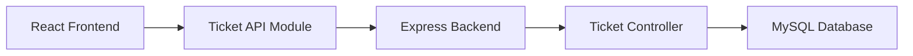

# Full-Stack Ticket Management System

A full-stack web application for managing support tickets through a React-based frontend, a Node.js/Express backend, and a MySQL database.

## Overview

This project is a portfolio-oriented full-stack web application designed around a ticket management workflow. It provides a web interface for viewing ticket information, creating new tickets, editing existing tickets, viewing ticket details, and managing tickets through a structured frontend and backend architecture.

The application is organized into separate frontend and backend projects:

* **Frontend:** React application built with Vite
* **Backend:** Node.js application using Express
* **Database:** MySQL, accessed through the `mysql2` package
* **API communication:** The frontend communicates with the backend through a dedicated ticket API module

The project demonstrates practical full-stack development concepts including component-based UI development, client-side routing, REST-style backend architecture, database connectivity, CRUD-oriented application workflows, error handling, and environment-based database configuration.

## The repository structure confirms separate `backend` and `frontend` applications, with dedicated controller, middleware, database configuration, API, component, and page layers.

## Features

Based on the implemented project structure, the application includes:

* Dashboard interface
* Ticket listing
* Ticket creation
* Ticket details view
* Ticket editing
* Ticket form component
* Ticket table component
* Dedicated frontend ticket API module
* Loading state handling
* Error state handling
* Empty state handling
* Reusable application layout
* Header and sidebar navigation
* Client-side routing
* Backend ticket controller
* Centralized backend error-handling middleware
* MySQL database connectivity
* Environment-based database configuration

The frontend contains dedicated pages for the dashboard, ticket list, ticket creation, ticket editing, and ticket details, together with reusable ticket and common UI components.

---

## Technology Stack

### Frontend

* **React**
* **JavaScript / JSX**
* **React DOM**
* **React Router**
* **Vite**
* **HTML**
* **CSS**

The project contains React application entry points, JSX components, React Router dependencies, and Vite tooling.

### Backend

* **Node.js**
* **Express.js**
* **JavaScript**
* **REST-style API architecture**
* **CORS**
* **dotenv**
* **mysql2**

The backend includes an Express server, controller layer, database configuration, error-handling middleware, and MySQL connectivity.

### Database

* **MySQL**
* **mysql2 Node.js driver**

The database connection is configured through environment variables including host, user, password, database name, and port.

### Development Tools

* **Git**
* **GitHub**
* **npm**
* **Vite development server**
* **Nodemon**

---

## Application Architecture

The application follows a separated frontend/backend architecture:



### Request Flow

1. The user interacts with the React frontend.
2. Frontend ticket operations are handled through `ticketApi.js`.
3. Requests are sent to the Express backend.
4. Backend logic is organized through the ticket controller.
5. The backend communicates with MySQL through the database configuration.
6. Errors are handled through dedicated backend middleware.
7. Results are returned to the frontend and presented through the appropriate page or component.

This separation keeps frontend presentation and interaction logic distinct from backend/API and database responsibilities.

---

## Project Structure

The repository is divided into `backend` and `frontend` applications. The original project tree also contains installed `node_modules` directories; these generated dependency files are intentionally omitted from the documented structure below. The application source structure is represented here instead.

```text
.
├── .gitignore
├── tree.txt
│
├── backend/
│   ├── .env
│   ├── package.json
│   ├── package-lock.json
│   ├── server.js
│   │
│   ├── config/
│   │   └── db.js
│   │
│   ├── controllers/
│   │   └── ticketController.js
│   │
│   └── middleware/
│       └── errorHandler.js
│
└── frontend/
    ├── .oxlintrc.json
    ├── index.html
    ├── package.json
    ├── package-lock.json
    ├── README.md
    │
    ├── public/
    │   ├── favicon.svg
    │   └── icons.svg
    │
    └── src/
        ├── App.css
        ├── App.jsx
        ├── index.css
        ├── main.jsx
        │
        ├── api/
        │   └── ticketApi.js
        │
        ├── assets/
        │   ├── hero.png
        │   ├── react.svg
        │   └── vite.svg
        │
        ├── components/
        │   ├── common/
        │   │   ├── EmptyState.jsx
        │   │   ├── ErrorMessage.jsx
        │   │   └── LoadingSpinner.jsx
        │   │
        │   ├── layout/
        │   │   ├── Header.jsx
        │   │   ├── Layout.jsx
        │   │   └── Sidebar.jsx
        │   │
        │   └── tickets/
        │       ├── TicketForm.jsx
        │       └── TicketTable.jsx
        │
        ├── pages/
        │   ├── CreateTicketPage.jsx
        │   ├── DashboardPage.jsx
        │   ├── EditTicketPage.jsx
        │   ├── TicketDetailPage.jsx
        │   └── TicketListPage.jsx
        │
        └── styles/
            └── global.css
```

### Backend

| Directory/File                    | Purpose                                                |
| --------------------------------- | ------------------------------------------------------ |
| `server.js`                       | Backend application entry point                        |
| `config/db.js`                    | Database configuration                                 |
| `controllers/ticketController.js` | Ticket-related backend logic                           |
| `middleware/errorHandler.js`      | Centralized backend error handling                     |
| `.env`                            | Local database configuration and environment variables |
| `package.json`                    | Backend dependencies and scripts                       |

### Frontend

| Directory/File            | Purpose                                             |
| ------------------------- | --------------------------------------------------- |
| `src/main.jsx`            | React application entry point                       |
| `src/App.jsx`             | Main application component                          |
| `src/api/ticketApi.js`    | Frontend ticket API communication                   |
| `src/components/common/`  | Reusable loading, error, and empty-state components |
| `src/components/layout/`  | Shared application layout, header, and sidebar      |
| `src/components/tickets/` | Reusable ticket-related UI components               |
| `src/pages/`              | Application pages                                   |
| `src/styles/`             | Global styling                                      |
| `src/assets/`             | Frontend assets                                     |

---

## Prerequisites

Before running the application locally, install:

* **Node.js**
* **npm**
* **MySQL Server**
* **Git**

## The project uses separate npm projects for the backend and frontend, each with its own `package.json` and `package-lock.json`.

## Installation

### 1. Clone the Repository

```bash
git clone <repository-url>
cd <repository-directory>
```

---

### 2. Backend Setup

Navigate to the backend directory:

```bash
cd backend
```

Install dependencies:

```bash
npm install
```

The backend has its own dependency manifest and lock file.

---

### 3. Database Setup

The backend uses MySQL through the `mysql2` package.

Create the required MySQL database and configure the connection using the environment variables described below.

> **Note:** No SQL schema or database initialization file is present in the supplied project structure. Therefore, the exact database schema and initialization commands cannot be documented from the repository tree alone.

---

### 4. Environment Variables

Create or configure the backend `.env` file with your local database configuration:

```env
DB_HOST=
DB_USER=
DB_PASSWORD=
DB_NAME=
DB_PORT=
```

These values should correspond to your local MySQL installation.

**Never commit `.env` files containing credentials or other sensitive configuration to GitHub.**

A safer repository practice is to provide an `.env.example` file containing only variable names and placeholder values:

```env
DB_HOST=
DB_USER=
DB_PASSWORD=
DB_NAME=
DB_PORT=
```

Keep the actual `.env` file local and ensure it is excluded through `.gitignore`.

---

### 5. Frontend Setup

From the project root, navigate to the frontend directory:

```bash
cd frontend
```

Install dependencies:

```bash
npm install
```

The frontend is a Vite-based React application with its own npm configuration.

---

## Running the Application

The frontend and backend should be started separately during local development.

### Start the Backend

Open a terminal:

```bash
cd backend
npm start
```

If the backend's package scripts use a different development command, use the script defined in `backend/package.json`.

### Start the Frontend

Open a second terminal:

```bash
cd frontend
npm run dev
```

Vite provides the frontend development server.

The exact backend port and frontend development URL should be taken from the project's actual runtime configuration rather than assumed from the directory structure.

---

## API Documentation

The project contains a dedicated backend ticket controller and a frontend `ticketApi.js` module, indicating a ticket-oriented API layer.
However, the supplied `tree /F` output identifies files and directories but does not contain the source code inside those files. Therefore, the exact HTTP methods, endpoint paths, request bodies, query parameters, and response structures cannot be reliably documented without inspecting the implementation.

To avoid inventing API contracts, endpoint details are intentionally omitted from this README until the backend route definitions are available.

---

## Database

### Database Technology

**MySQL**

The backend includes a dedicated database configuration module and the `mysql2` dependency.

### Configuration

Database connectivity is configured through:

```env
DB_HOST=
DB_USER=
DB_PASSWORD=
DB_NAME=
DB_PORT=
```

The supplied project structure does not include a SQL schema or migration directory, so the exact table names, columns, indexes, and relationships are not documented here.

---

## Search and Filtering

The supplied project structure confirms a ticket list page and ticket table component:

```text
TicketListPage.jsx
TicketTable.jsx
```

However, the presence of these files alone does not establish that search or filtering functionality is implemented.

Therefore, specific search or filtering capabilities are not claimed in this README without confirmation from the application source code.

---

## Screenshots

Screenshots were not included in the supplied project structure.

When screenshots are added to the repository, they can be documented here, for example:

```markdown
## Screenshots

### Dashboard


### Ticket List


### Ticket Details

```

Do not add these image references until the corresponding files actually exist in the repository.

---

## Security and Development Practices

The project demonstrates several development practices that can be confirmed from its structure:

* **Environment-based database configuration** through `.env` variables.
* **Separation of frontend and backend applications.**
* **Dedicated database configuration module.**
* **Dedicated controller layer for ticket operations.**
* **Centralized backend error-handling middleware.**
* **Dedicated frontend API module for ticket communication.**
* **Reusable React components for common UI states.**
* **Component-based frontend organization.**
* **Git repository management through `.gitignore`.**

The repository includes `errorHandler.js`, `db.js`, `ticketController.js`, and `ticketApi.js` as separate modules rather than placing all application logic in a single file.

### Environment Security

Database credentials should remain outside source control.

Do not commit:

```text
.env
```

Do commit, if desired:

```text
.env.example
```

with placeholder values only.

---

## Future Improvements

The following are potential improvements and are **not presented as currently implemented features**:

* Authentication and authorization
* Role-based access control
* Ticket assignment to specific users
* Pagination for large ticket datasets
* More advanced search and filtering
* Automated unit and integration testing
* API documentation with OpenAPI/Swagger
* Request validation with a dedicated validation library
* Structured application logging
* Production deployment
* CI/CD pipeline
* Containerization with Docker
* Database migrations and seed scripts
* Production monitoring and observability

---

## Learning / Technical Highlights

This project demonstrates practical experience with:

* **React frontend development**
* **Component-based UI architecture**
* **React Router**
* **Reusable React components**
* **Frontend API integration**
* **Node.js backend development**
* **Express.js**
* **REST-style API architecture**
* **MySQL database integration**
* **CRUD-oriented application workflows**
* **Separation of concerns**
* **Backend controller architecture**
* **Error handling**
* **Environment-based configuration**
* **npm dependency management**
* **Git/GitHub project organization**

The project is particularly relevant as a portfolio piece because it demonstrates the connection between the major layers of a full-stack application rather than focusing exclusively on frontend or backend development.

---

## Author

**Nazhatullah Wajdi**

* GitHub: https://github.com/nazhatwaj72-ux
* LinkedIn: https://www.linkedin.com/in/nazhatullah-wajdi-218729379/
