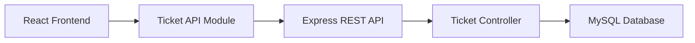
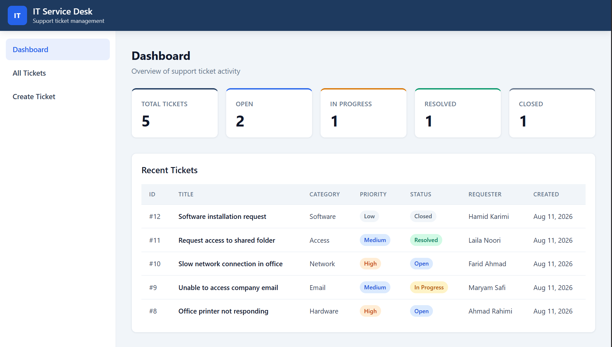
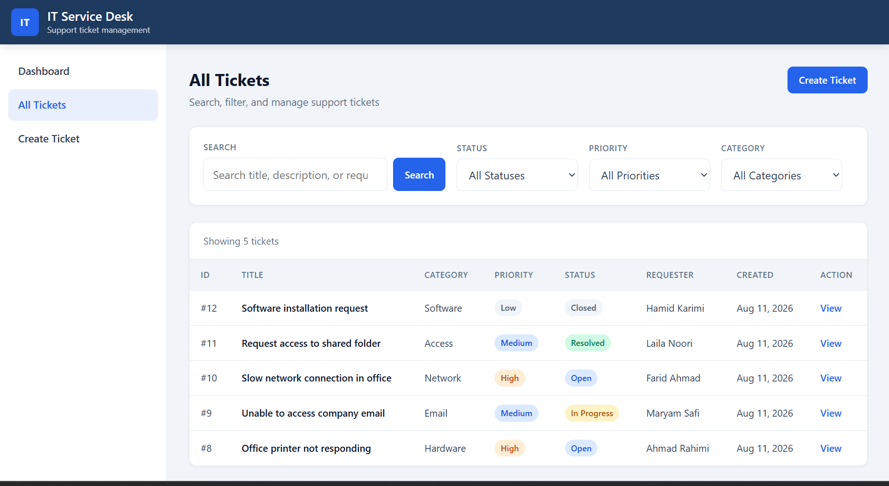
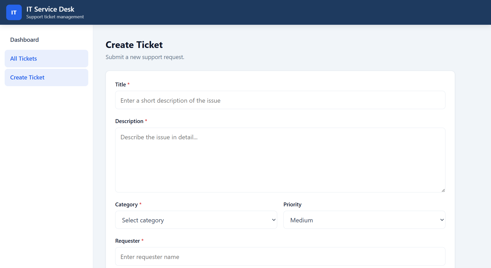
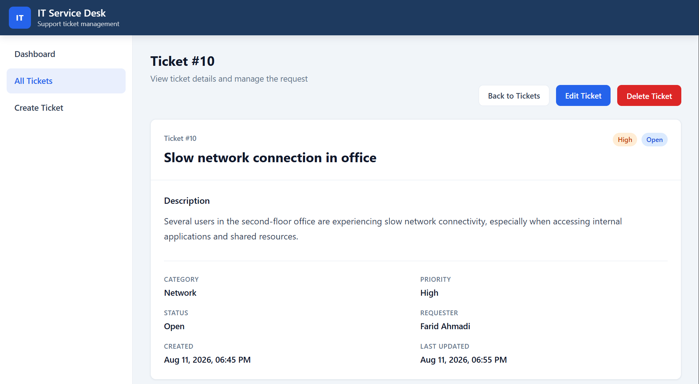

# Full-Stack Ticket Management System

A full-stack ticket management web application built with **React, Node.js, Express, and MySQL**. The application provides a structured interface for creating, viewing, updating, searching, filtering, and managing support tickets through a REST-style API.

This project was developed as a portfolio project to demonstrate practical **full-stack web development**, including frontend development, backend API development, database integration, CRUD operations, reusable components, error handling, and Git/GitHub workflow.

---

## Features

### Ticket Management

* Create new support tickets
* View all tickets
* View individual ticket details
* Update existing tickets
* Delete tickets
* Display ticket status and priority using visual badges
* Display requester, category, and creation date

### Search & Filtering

* Search tickets by title, description, or requester
* Filter tickets by status
* Filter tickets by priority
* Filter tickets by category
* Apply multiple filters together
* Clear active filters
* Search is performed when the user clicks the **Search** button or presses **Enter**

### Dashboard

* Total ticket count
* Open tickets
* In-progress tickets
* Resolved tickets
* Closed tickets
* Recent ticket overview

### User Interface

* Responsive layout
* Dashboard interface
* Sidebar navigation
* Header navigation
* Reusable React components
* Loading states
* Error states
* Empty states
* Responsive ticket tables
* Ticket creation and editing forms
* Ticket detail view

---

## Technology Stack

### Frontend

* **React**
* **JavaScript / JSX**
* **React Router**
* **Vite**
* **HTML5**
* **CSS3**

### Backend

* **Node.js**
* **Express.js**
* **JavaScript**
* **REST-style API**
* **CORS**
* **dotenv**
* **mysql2**

### Database

* **MySQL**

### Development Tools

* **Git**
* **GitHub**
* **npm**
* **Nodemon**
* **Vite**

---

## Application Architecture

The application uses a separated frontend and backend architecture.



### Request Flow

1. The user interacts with the React frontend.
2. React pages and components handle the user interface.
3. `ticketApi.js` manages communication with the backend API.
4. Express receives the HTTP request.
5. The ticket controller processes the requested operation.
6. The backend communicates with MySQL.
7. The API returns the result to the frontend.
8. React updates the interface based on the response.

This separation keeps presentation logic, API communication, backend logic, and database access organized independently.

---

## Project Structure

```text
.
├── .gitignore
│
├── backend/
│   ├── .env.example
│   ├── package.json
│   ├── package-lock.json
│   ├── server.js
│   │
│   ├── config/
│   │   └── db.js
│   │
│   ├── controllers/
│   │   └── ticketController.js
│   │
│   └── middleware/
│       └── errorHandler.js
│
└── frontend/
    ├── .gitignore
    ├── .oxlintrc.json
    ├── index.html
    ├── package.json
    ├── package-lock.json
    │
    ├── public/
    │   ├── favicon.svg
    │   └── icons.svg
    │
    └── src/
        ├── App.css
        ├── App.jsx
        ├── index.css
        ├── main.jsx
        │
        ├── api/
        │   └── ticketApi.js
        │
        ├── assets/
        │   ├── hero.png
        │   ├── react.svg
        │   └── vite.svg
        │
        ├── components/
        │   ├── common/
        │   │   ├── EmptyState.jsx
        │   │   ├── ErrorMessage.jsx
        │   │   └── LoadingSpinner.jsx
        │   │
        │   ├── layout/
        │   │   ├── Header.jsx
        │   │   ├── Layout.jsx
        │   │   └── Sidebar.jsx
        │   │
        │   └── tickets/
        │       ├── TicketForm.jsx
        │       └── TicketTable.jsx
        │
        ├── pages/
        │   ├── CreateTicketPage.jsx
        │   ├── DashboardPage.jsx
        │   ├── EditTicketPage.jsx
        │   ├── TicketDetailPage.jsx
        │   └── TicketListPage.jsx
        │
        └── styles/
            └── global.css
```

---

## Backend Structure

| File                              | Purpose                                                  |
| --------------------------------- | -------------------------------------------------------- |
| `server.js`                       | Express application entry point and server configuration |
| `config/db.js`                    | MySQL database connection configuration                  |
| `controllers/ticketController.js` | Ticket CRUD, search, filtering, and statistics logic     |
| `middleware/errorHandler.js`      | Centralized backend error handling                       |
| `.env.example`                    | Example database environment configuration               |

---

## Frontend Structure

| File / Directory          | Purpose                                             |
| ------------------------- | --------------------------------------------------- |
| `src/main.jsx`            | React application entry point                       |
| `src/App.jsx`             | Main application and route configuration            |
| `src/api/ticketApi.js`    | Handles communication with the ticket API           |
| `src/pages/`              | Application pages                                   |
| `src/components/common/`  | Reusable loading, error, and empty-state components |
| `src/components/layout/`  | Header, sidebar, and application layout             |
| `src/components/tickets/` | Reusable ticket-related components                  |
| `src/styles/`             | Global application styling                          |
| `src/assets/`             | Frontend assets                                     |

---

## REST API

The backend provides a ticket-oriented REST API.

### Tickets

| Method   | Endpoint             | Description                |
| -------- | -------------------- | -------------------------- |
| `GET`    | `/api/tickets`       | Retrieve tickets           |
| `GET`    | `/api/tickets/:id`   | Retrieve a specific ticket |
| `POST`   | `/api/tickets`       | Create a new ticket        |
| `PUT`    | `/api/tickets/:id`   | Update a ticket            |
| `DELETE` | `/api/tickets/:id`   | Delete a ticket            |
| `GET`    | `/api/tickets/stats` | Retrieve ticket statistics |

### Search and Filtering

The ticket listing endpoint supports query parameters for filtering and searching.

Example:

```text
GET /api/tickets?status=Open
```

Multiple filters can be combined:

```text
GET /api/tickets?status=Open&priority=High&category=Network
```

Search can also be performed:

```text
GET /api/tickets?search=printer
```

The frontend builds these query parameters through the dedicated API module:

```text
frontend/src/api/ticketApi.js
```

---

## Database

The application uses **MySQL** for persistent ticket storage.

The backend uses the `mysql2` package to communicate with the database.

Database configuration is provided through environment variables.

```env
DB_HOST=
DB_USER=
DB_PASSWORD=
DB_NAME=
DB_PORT=
```

### Environment Variables

| Variable      | Description           |
| ------------- | --------------------- |
| `DB_HOST`     | MySQL server hostname |
| `DB_USER`     | MySQL username        |
| `DB_PASSWORD` | MySQL password        |
| `DB_NAME`     | Database name         |
| `DB_PORT`     | MySQL server port     |

---

## Prerequisites

Before running the project locally, install:

* **Node.js**
* **npm**
* **MySQL Server**
* **Git**

---

## Installation

### 1. Clone the Repository

```bash
git clone https://github.com/nazhatwaj72-ux/it-service-desk.git
cd it-service-desk
```

---

### 2. Configure the Database

Create a MySQL database for the application.

Then configure the backend environment variables.

Navigate to the backend:

```bash
cd backend
```

Create a `.env` file:

```env
DB_HOST=localhost
DB_USER=your_mysql_user
DB_PASSWORD=your_mysql_password
DB_NAME=your_database_name
DB_PORT=3306
```

Use your actual local MySQL credentials.

**Do not commit `.env` to GitHub.**

---

### 3. Install Backend Dependencies

From the `backend` directory:

```bash
npm install
```

---

### 4. Install Frontend Dependencies

Open another terminal and navigate to the frontend:

```bash
cd frontend
npm install
```

---

## Running the Application

The frontend and backend run separately during development.

### Start the Backend

From the `backend` directory:

```bash
npm start
```

If the project provides a development script using Nodemon, it can be started using the corresponding script from `package.json`.

### Start the Frontend

From the `frontend` directory:

```bash
npm run dev
```

Vite will provide the local development address in the terminal.

---

## Search & Filtering Workflow

The ticket list provides a manual search and filtering workflow.

### Search

Enter a search term in the search field and click **Search**.

The search can target:

* Ticket title
* Ticket description
* Requester

The search can also be submitted by pressing **Enter**.

### Filters

Tickets can be filtered using:

* Status
* Priority
* Category

Multiple filters can be combined.

### Clear Filters

The **Clear Filters** button resets all active search and filter criteria.

---

## Error Handling

The application includes error-handling mechanisms on both the frontend and backend.

### Frontend

Reusable components handle:

* Loading states
* API errors
* Empty results
* Failed requests

### Backend

The backend uses centralized error-handling middleware:

```text
backend/middleware/errorHandler.js
```

This provides a consistent mechanism for handling server-side errors.

---

## Responsive Design

The frontend is designed to work across different screen sizes.

Responsive behavior includes:

* Mobile navigation
* Responsive sidebar
* Responsive ticket tables
* Mobile-friendly forms
* Responsive dashboard cards
* Flexible page layouts

The interface adapts between desktop and smaller mobile screen sizes using CSS media queries.

---

## Security & Development Practices

The project follows several practical development practices:

* Environment variables for database credentials
* `.gitignore` configuration for sensitive/local files
* Separation of frontend and backend responsibilities
* Centralized backend error handling
* Dedicated database configuration
* Dedicated API communication module
* Reusable React components
* Separation of pages, components, and API logic
* Input handling and validation through the ticket forms
* Git-based version control

### Environment Security

The actual `.env` file should remain local.

The repository should contain:

```text
.env.example
```

rather than credentials.

Example:

```env
DB_HOST=
DB_USER=
DB_PASSWORD=
DB_NAME=
DB_PORT=
```

Never commit real database passwords or other sensitive credentials.

---

## Screenshots

Screenshots can be added to document the main application interfaces.

## Screenshots

### Dashboard

The dashboard provides an overview of ticket statistics and recently created tickets.



### Ticket List

The ticket list provides searchable and filterable access to support tickets by status, priority, category, and search terms.



### Create Ticket

The ticket creation interface allows users to submit new support tickets with the required metadata.



### Ticket Details

The ticket details page displays the complete information for an individual ticket and provides actions for managing it.



---

## Skills Demonstrated

This project demonstrates practical experience with:

* React
* JavaScript / JSX
* React Router
* Vite
* HTML5
* CSS3
* Node.js
* Express.js
* REST APIs
* MySQL
* Database integration
* CRUD operations
* API integration
* Search and filtering
* Error handling
* Responsive web design
* Component-based architecture
* Separation of concerns
* Environment configuration
* Git and GitHub

---

## Future Improvements

Potential future improvements include:

* User authentication
* Role-based access control
* Ticket assignment
* Pagination
* Advanced ticket sorting
* Automated unit and integration testing
* API documentation using OpenAPI/Swagger
* Database migrations and seed scripts
* Docker containerization
* CI/CD pipeline
* Cloud deployment
* Production monitoring and logging

These are planned extensions and are not represented as currently implemented features.

---

## Portfolio Purpose

This project was developed as a practical portfolio application to demonstrate the ability to build and connect the major layers of a full-stack web application.

It demonstrates the complete workflow from:

**React UI → API communication → Express backend → MySQL database**

while incorporating practical features such as CRUD operations, search and filtering, dashboard statistics, reusable components, responsive design, and error handling.

---

## Author

**Nazhatullah Wajdi**

**GitHub:**
https://github.com/nazhatwaj72-ux

**LinkedIn:**
https://www.linkedin.com/in/nazhatullah-wajdi-218729379/
